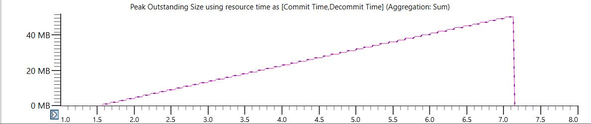
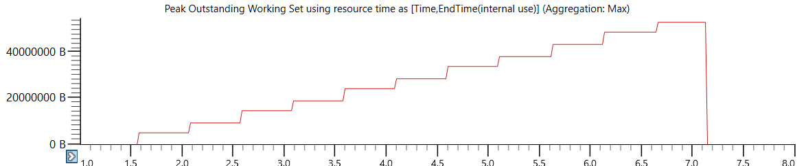
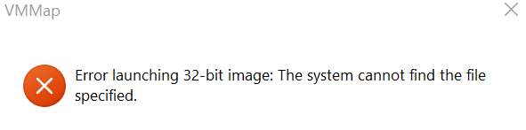
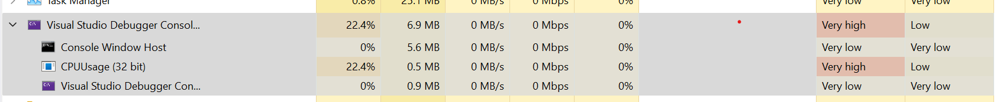
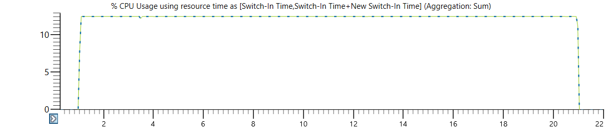
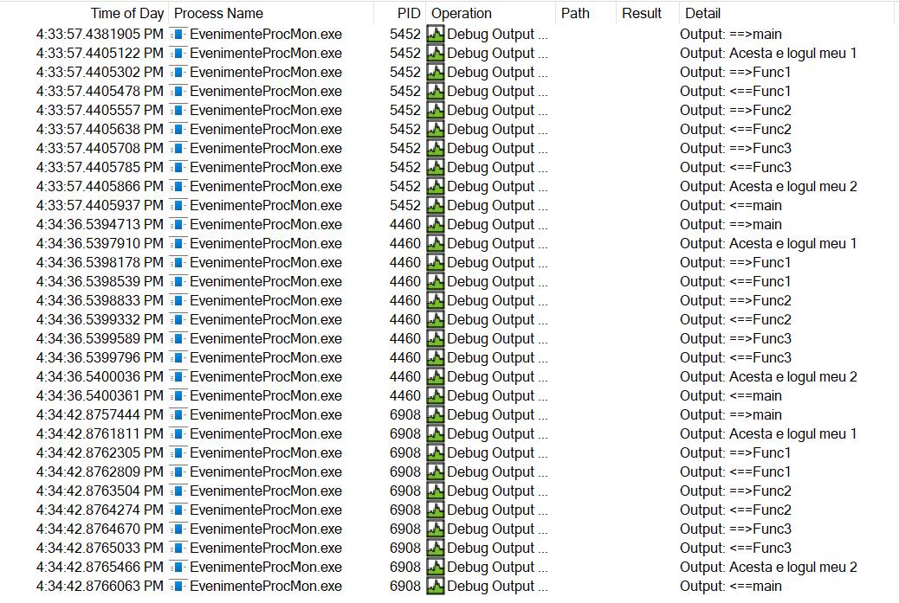
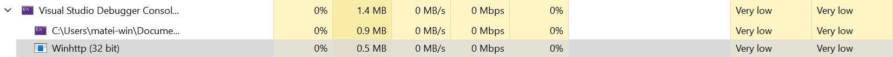
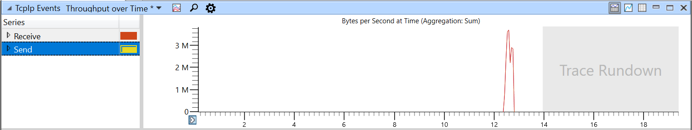
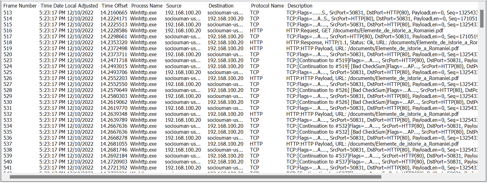
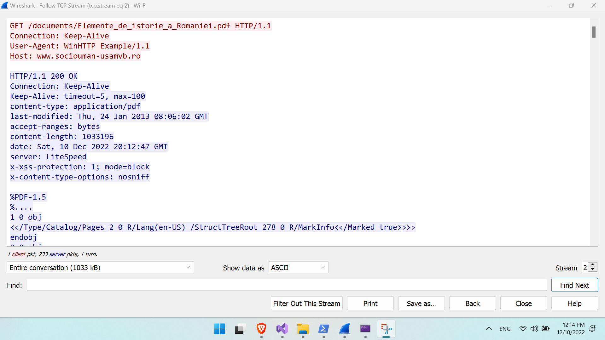

**Testing conditions**: All of the below results were captured on a Windows 11
native OS.

# RAM Monitoring

{#fig:1virtualalloc}

{#fig:1virtualmemoryscreenshot}

Using **Windows Performance Recorder** and **Analyzer** yields a bird's eye view of memory allocated in time. (See [@fig:1virtualalloc;@fig:1virtualmemoryscreenshot].) However faults were not generated at run time, meaning that these pages were only reserved, not used.

{#fig:1vmmap}

Trying to use **VMMap** I ran into a error (see @fig:1vmmap).

However using the **Visual Leak Detector** library resulted in a more in depth response as to where, when and how many leaks could be attributed to the program.

```haskell
---------- Block 50 at 0x0437F040: 1048576 bytes ----------
  Leak Hash: 0xC3B90F16, Count: 1, Total 1048576 bytes
  Call Stack (TID 776):
    ucrtbased.dll!malloc()
    C:\Users\matei-win\Documents\EP\Task-01\MemoryLeak\Source.cpp (10): MemoryLeak.exe!main() + 0xD bytes
    d:\a01\_work\38\s\src\vctools\crt\vcstartup\src\startup\exe_common.inl (78): MemoryLeak.exe!invoke_main() + 0x2D bytes
    d:\a01\_work\38\s\src\vctools\crt\vcstartup\src\startup\exe_common.inl (288): MemoryLeak.exe!__scrt_common_main_seh() + 0x5 bytes
    d:\a01\_work\38\s\src\vctools\crt\vcstartup\src\startup\exe_common.inl (331): MemoryLeak.exe!__scrt_common_main()
    d:\a01\_work\38\s\src\vctools\crt\vcstartup\src\startup\exe_main.cpp (17): MemoryLeak.exe!mainCRTStartup()
    KERNEL32.DLL!BaseThreadInitThunk() + 0x19 bytes
    ntdll.dll!RtlGetFullPathName_UEx() + 0x4C2 bytes
    ntdll.dll!RtlGetFullPathName_UEx() + 0x48D bytes
  Data:
    CD CD CD CD    CD CD CD CD    CD CD CD CD    CD CD CD CD     ........ ........
    CD CD CD CD    CD CD CD CD    CD CD CD CD    CD CD CD CD     ........ ........
    CD CD CD CD    CD CD CD CD    CD CD CD CD    CD CD CD CD     ........ ........
    CD CD CD CD    CD CD CD CD    CD CD CD CD    CD CD CD CD     ........ ........
    CD CD CD CD    CD CD CD CD    CD CD CD CD    CD CD CD CD     ........ ........
    CD CD CD CD    CD CD CD CD    CD CD CD CD    CD CD CD CD     ........ ........
    CD CD CD CD    CD CD CD CD    CD CD CD CD    CD CD CD CD     ........ ........
    CD CD CD CD    CD CD CD CD    CD CD CD CD    CD CD CD CD     ........ ........
    CD CD CD CD    CD CD CD CD    CD CD CD CD    CD CD CD CD     ........ ........
    CD CD CD CD    CD CD CD CD    CD CD CD CD    CD CD CD CD     ........ ........
    CD CD CD CD    CD CD CD CD    CD CD CD CD    CD CD CD CD     ........ ........
    CD CD CD CD    CD CD CD CD    CD CD CD CD    CD CD CD CD     ........ ........
    CD CD CD CD    CD CD CD CD    CD CD CD CD    CD CD CD CD     ........ ........
    CD CD CD CD    CD CD CD CD    CD CD CD CD    CD CD CD CD     ........ ........
    CD CD CD CD    CD CD CD CD    CD CD CD CD    CD CD CD CD     ........ ........
    CD CD CD CD    CD CD CD CD    CD CD CD CD    CD CD CD CD     ........ ........


Visual Leak Detector detected 50 memory leaks (52430600 bytes).
Largest number used: 52430600 bytes.
Total allocations: 52430600 bytes.
```

# CPU Monitoring

{#fig:2cputm}

{#fig:2cpuwp}

A short recap of how to monitor processor usage can be seen in [@fig:2cputm;@fig:2cpuwp].

{#fig:2pm}

In this laboratory interacting with **Processes Monitor** was no longer asynchronous, but we learned that we can send to it debug output messages as in @fig:2pm.

I find the task of writing a Python script to parse the CSV output of @fig:2pm too hard of a task to be released. Given that these functions mutually recursive, a fully blown parser (like ANTLR) is need (in my humble opinion).

# Network Monitoring

{#fig:3tm}

{#fig:3wp}

{#fig:3wnm}

{#fig:3wireshark}

If we are interested in a peeks of what communications done by our program any of the tools in [@fig:3tm;@fig:3wp;@fig:3wnm] could do the job. However **Wireshark** (see @fig:3wireshark) proved to be the most useful for intercepting Neagu Djuvara's "O SCURTĂ ISTORIE A ROMÂNILOR POVESTITĂ CELOR TINERI".

# Feedback

```bash
$ firefox https://forms.gle/LWBWYsMiJq8FsYdN9
$ date | md5sum
03b952eefd4f718f21c371f5120f193a  -
```