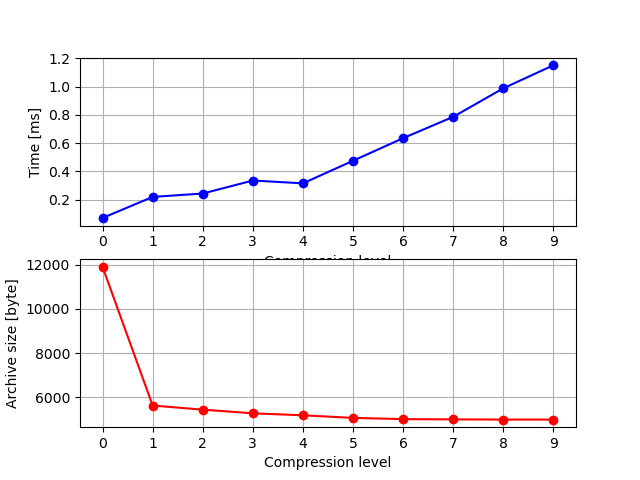

# Task 01 - `vmstat`

## A - Monitoring stress

[](https://asciinema.org/a/XVqCk7lCqxo5LrxPEOaDCKWSh)

## B - How does it work?

```bash
$ strace vmstat 2>&1 | grep --color '/proc'
openat(AT_FDCWD, "/proc/self/auxv", O_RDONLY) = 3
openat(AT_FDCWD, "/proc/sys/kernel/osrelease", O_RDONLY) = 3
openat(AT_FDCWD, "/proc/self/auxv", O_RDONLY) = 3
openat(AT_FDCWD, "/usr/share/locale/en_US.UTF-8/LC_MESSAGES/procps-ng.mo", O_RDONLY) = -1 ENOENT (No such file or directory)
openat(AT_FDCWD, "/usr/share/locale/en_US.utf8/LC_MESSAGES/procps-ng.mo", O_RDONLY) = -1 ENOENT (No such file or directory)
openat(AT_FDCWD, "/usr/share/locale/en_US/LC_MESSAGES/procps-ng.mo", O_RDONLY) = -1 ENOENT (No such file or directory)
openat(AT_FDCWD, "/usr/share/locale/en.UTF-8/LC_MESSAGES/procps-ng.mo", O_RDONLY) = -1 ENOENT (No such file or directory)
openat(AT_FDCWD, "/usr/share/locale/en.utf8/LC_MESSAGES/procps-ng.mo", O_RDONLY) = -1 ENOENT (No such file or directory)
openat(AT_FDCWD, "/usr/share/locale/en/LC_MESSAGES/procps-ng.mo", O_RDONLY) = -1 ENOENT (No such file or directory)
openat(AT_FDCWD, "/proc/sys/kernel/osrelease", O_RDONLY) = 3
openat(AT_FDCWD, "/proc/meminfo", O_RDONLY) = 3
openat(AT_FDCWD, "/proc/stat", O_RDONLY) = 4
openat(AT_FDCWD, "/proc/vmstat", O_RDONLY) = 5
```

## C - USO flashbacks

```python
$ sudo vmstat -d | tail -n +3
nvme0n1  64121  47316 5648488   16469  30561  29258 1671410   78920      0     66
```

# Task 02 - `mpstat`

## A - Python recursion depth

[](https://asciinema.org/a/zx1MBSrq10BVSIAljQ59cTOZ4)

## B - CPU affinity

[](https://asciinema.org/a/n3heBACoDy7QZ3ClZJkfmUSdm)

I observed a 13% load increase on CPU 0. It seems that although 7 stress processes were launched, only one CPU was used...

## C - USO flashbacks

```bash
taskset --cpu-list $(seq -s, 1 2 $(($(nproc)-1))) stress -c $(($(nproc)/2))
```

Not able to test.

# Task 03 - Zip with compression levels

## A - Measurements

```bash
$ TIMEFORMAT=%R; for i in {0..9}; do echo $i; time zip -$i -q archive.zip *.BMP big.txt; du archive.zip; done
0
0,071
11908   archive.zip
1
0,220
5628    archive.zip
2
0,244
5440    archive.zip
3
0,336
5276    archive.zip
4
0,316
5184    archive.zip
5
0,476
5068    archive.zip
6
0,636
5012    archive.zip
7
0,787
5000    archive.zip
8
0,989
4992    archive.zip
9
1,152
4992    archive.zip
```

# B - Plot

{width=60%}

# Task 04 - Hardware counters

## Task A - Hardware Info

```python
$ cpuid -r | grep 0x0000000a
   0x0000000a 0x00: eax=0x07300404 ebx=0x00000000 ecx=0x00000000 edx=0x00000603
   0x0000000a 0x00: eax=0x07300404 ebx=0x00000000 ecx=0x00000000 edx=0x00000603
   0x0000000a 0x00: eax=0x07300404 ebx=0x00000000 ecx=0x00000000 edx=0x00000603
   0x0000000a 0x00: eax=0x07300404 ebx=0x00000000 ecx=0x00000000 edx=0x00000603
   0x0000000a 0x00: eax=0x07300404 ebx=0x00000000 ecx=0x00000000 edx=0x00000603
   0x0000000a 0x00: eax=0x07300404 ebx=0x00000000 ecx=0x00000000 edx=0x00000603
   0x0000000a 0x00: eax=0x07300404 ebx=0x00000000 ecx=0x00000000 edx=0x00000603
   0x0000000a 0x00: eax=0x07300404 ebx=0x00000000 ecx=0x00000000 edx=0x00000603
```

## Task B - Unlock RDPMC in ring3

```bash
$ make
make -C /lib/modules/`uname -r`/build M=`pwd`
make[1]: Entering directory '/usr/src/linux-headers-5.10.0-18-amd64'
  CC [M]  /home/matei/Downloads/hw_counter/hack_cr4.o
  MODPOST /home/matei/Downloads/hw_counter/Module.symvers
  CC [M]  /home/matei/Downloads/hw_counter/hack_cr4.mod.o
  LD [M]  /home/matei/Downloads/hw_counter/hack_cr4.ko
make[1]: Leaving directory '/usr/src/linux-headers-5.10.0-18-amd64'
gcc -o mat_mul mat_mul.c
$ sudo insmod hack_cr4.ko
$ sudo dmesg | grep PCE
[10745.626680] haccah: Setting PCE on core #1
[10745.626680] haccah: Setting PCE on core #5
[10745.626682] haccah: Setting PCE on core #0
[10745.626683] haccah: Setting PCE on core #2
[10745.626683] haccah: Setting PCE on core #6
[10745.626684] haccah: Setting PCE on core #3
[10745.626685] haccah: Setting PCE on core #7
[10745.626687] haccah: Setting PCE on core #4
```

## Task C - Configure IA32_PERF_GLOBAL_CTRL

```python
$ sudo rdmsr -a 0x38f
f
70000000f
70000000f
70000000f
70000000f
70000000f
70000000f
70000000f
$ sudo wrmsr -a 0x38f 0x70000000f
$ sudo rdmsr -a 0x38f
70000000f
70000000f
70000000f
70000000f
70000000f
70000000f
70000000f
70000000f
```

## Task D

```bash
$ sudo rdmsr -a 0x186
0
0
0
0
0
0
0
0
$ sudo wrmsr -a 0xc1 0x00
$ sudo wrmsr -a 0x186 0x413f24
$ sudo rdmsr -a 0x187
0
0
0
0
0
0
0
0
$ sudo rdmsr -a 0x188
0
0
0
0
0
0
0
0
$ sudo rdmsr -a 0x189
0
0
0
0
0
0
0
0
```

## Task E

Cannot pass a kernel trap...

```bash
$ sudo dmesg | tail -n 1
[21393.226134] traps: mat_mul[47754] general protection fault ip:55885e188324 sp:7fffe6200ea0 error:0 in mat_mul[55885e188000+1000]
```

Still wondering how it's done.

# Task 05 - Feedback

Given that posting a picture with me completing the  feedback reveals metadata
about the hour at which it was filled, I found that posting a md5sum of the
approximate time is best because it could be reversed, but only with enough
computational power to spare.

```bash
$ firefox https://forms.gle/LWBWYsMiJq8FsYdN9
$ date | md5sum
2e1f89cd3e91765e72251a1790ef13f1  -
```

Note I am using Bucharest local configuration.
