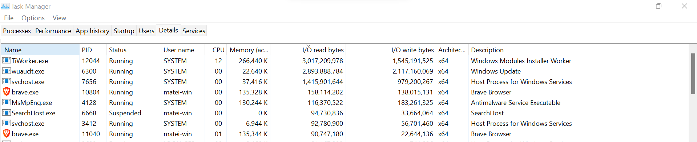
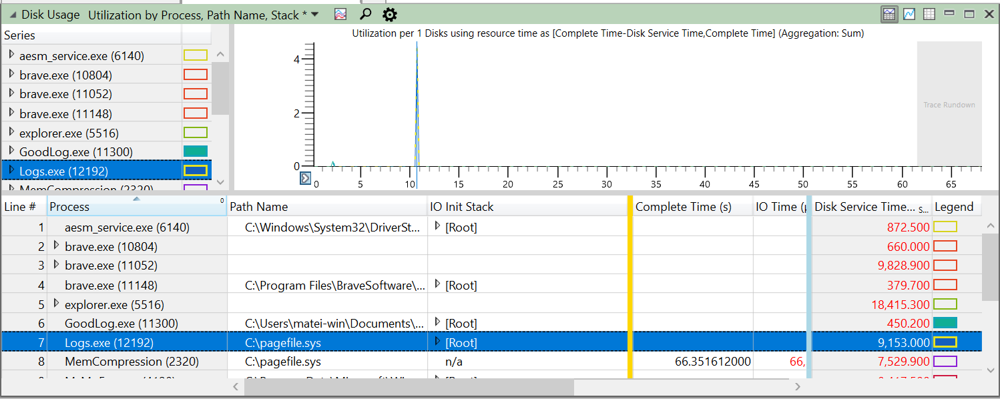
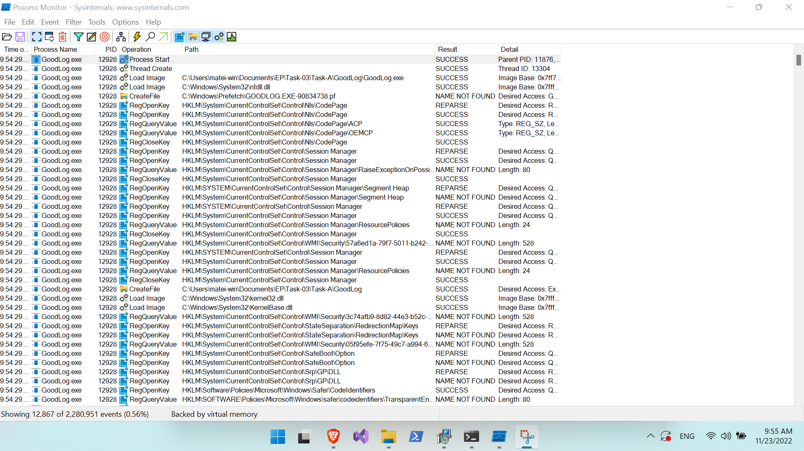
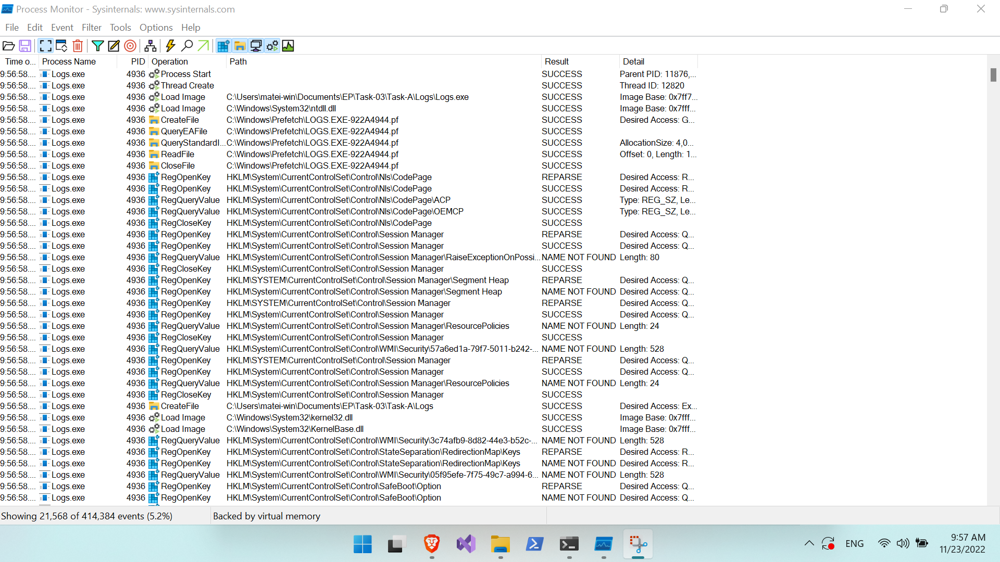
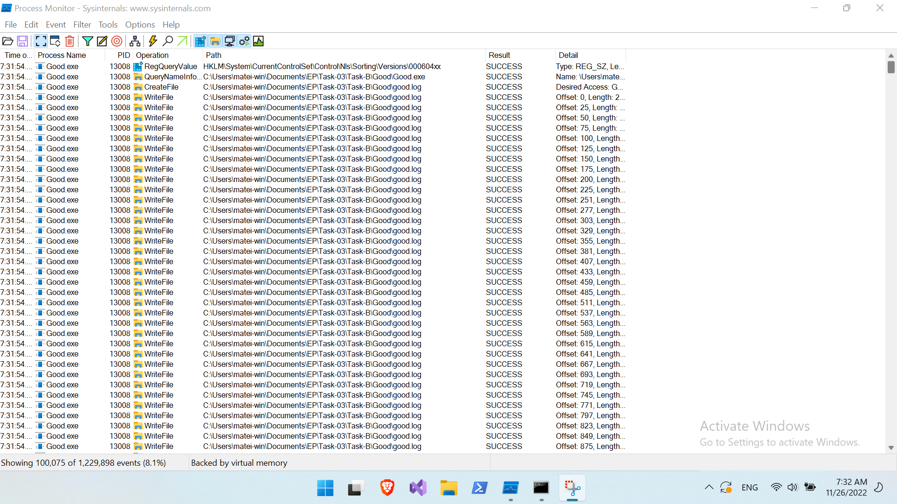
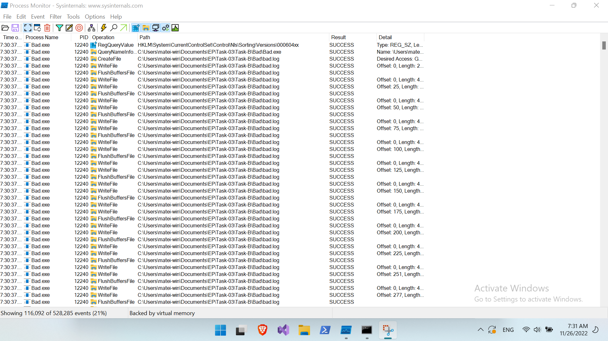
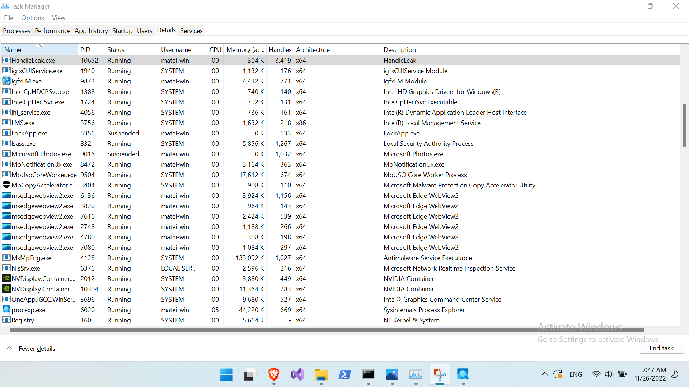
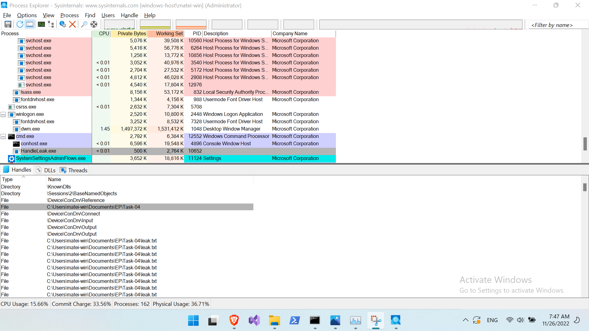

**Testing conditions**: All of the below results were captured on a Windows 11
native OS.

# Task Manager

{#fig:Task1}

The process which makes the most I/O reads/writs is *TiWorker.exe*, a Windows
Modules Installer Worker. (See @fig:Task1.) This makes sense, since installing anything requires
reading a description and creating the file structure according to it.

# Windows Performance Recorder & Analyzer

{#fig:Task2}

It is clear that *GoodLog.exe* peaks at a much lower usage (green), unlike the
other which sky-rockets. (See @fig:Task2.)

Inside Task Manager we get a instant value, very similar to the first task, of
I/O reads/writes, which, for *Logs.exe*, not only spans a greater time interval
of observation, but is higher than the improved versions.

# Process Monitor

## Checking Logging File

{#fig:Task3A-Good}

{#fig:Task3A-Bad}

For all intents and purposes, I will repeat the explanation for *Logs.exe* (see [@fig:Task3A-Good;@fig:Task3A-Bad]) offered by the
didactic team, as follows:

> the file is opened and closed for every writing operation which explains the
> significant slowdown.

## Investigating a Handle Leak

{#fig:Task3B-GoodPM}

{#fig:Task3B-BadPM}

{#fig:Task3B-Bad}

For this experiment, on my machine it's unfeasible to take a snapshot of both
processes in Task Manager. (See [@fig:Task3B-GoodPM;@fig:Task3B-BadPM;@fig:Task3B-Bad].)

# Process Explorer

{#fig:Task4TM}

{#fig:Task4PE}

As we can see Process Explorer helps us find which handles of files are leaked. (See [@fig:Task4TM;@fig:Task4PE].)

# Windows API

The implementation of a command-line task manager is attached as a file.

```javascript
CommitTotal, CommitLimit, CommitPeak, PhysicalTotal, PhysicalAvailable, SystemCache, KernelTotal, KernelPaged, KernelNonpaged, PageSize, HandleCount, ProcessCount, ThreadCount
2005564, 4915897, 2158948, 4162233, 2405588, 998854, 130625, 70090, 60535, 4096, 86631, 192, 2301

ProcessName, PageFaultCount, PeakWorkingSetSize, WorkingSetSize, QuotaPeakPagedPoolUsage, QuotaPagedPoolUsage, QuotaPeakNonPagedPoolUsage, QuotaNonPagedPoolUsage, PagefileUsage, PeakPagefileUsage
DPM.exe, 15368, 44864, 39320, 587, 486, 26, 24, 27336, 27444
sihost.exe, 10537, 31452, 31196, 304, 287, 20, 18, 6020, 6368
svchost.exe, 5515, 20028, 19764, 184, 182, 59, 15, 5020, 5596
svchost.exe, 14034, 27884, 25392, 250, 231, 17, 15, 5376, 6392
igfxEM.exe, 6985, 19976, 18828, 248, 234, 25, 18, 4684, 5156
taskhostw.exe, 5803, 16776, 16720, 193, 190, 30, 28, 5848, 5968
explorer.exe, 216104, 227896, 200660, 2482, 2322, 133, 105, 93836, 122036
SearchHost.exe, 119665, 222724, 190196, 1143, 1085, 93, 81, 104360, 135440
StartMenuExperienceHost.exe, 32359, 90316, 87184, 946, 763, 40, 32, 29932, 33068
RuntimeBroker.exe, 5539, 20524, 19676, 212, 207, 14, 13, 3188, 3752
svchost.exe, 4118, 13152, 10780, 182, 134, 13, 11, 2428, 3312
RuntimeBroker.exe, 18452, 45532, 41244, 378, 323, 55, 28, 9228, 17576
dllhost.exe, 6152, 13916, 12836, 155, 149, 30, 18, 4088, 5752
LockApp.exe, 16197, 60044, 56936, 614, 610, 26, 25, 13500, 14968
RuntimeBroker.exe, 10610, 34500, 28576, 316, 250, 39, 19, 6224, 8956
svchost.exe, 3988, 14088, 14004, 144, 141, 11, 11, 2576, 2764
svchost.exe, 6234, 19648, 19500, 192, 188, 13, 13, 3256, 3536
SecurityHealthSystray.exe, 2753, 9928, 9904, 158, 155, 11, 10, 1780, 1900
ApplicationFrameHost.exe, 20575, 46532, 43612, 459, 437, 30, 28, 22056, 24816
SystemSettings.exe, 81519, 140260, 90356, 2731, 2284, 137, 56, 54412, 87020
UserOOBEBroker.exe, 2666, 9756, 9672, 127, 125, 11, 10, 1904, 2096
devenv.exe, 2454557, 947068, 918404, 1622, 1512, 511, 355, 804036, 831036
PerfWatson2.exe, 133012, 98668, 98652, 414, 386, 325, 63, 78244, 78284
Microsoft.ServiceHub.Controller.exe, 186782, 80832, 75872, 390, 385, 116, 49, 54252, 59620
ServiceHub.ThreadedWaitDialog.exe, 61693, 97064, 96088, 873, 849, 123, 69, 58208, 59792
ServiceHub.VSDetouredHost.exe, 232464, 103760, 99688, 785, 711, 156, 86, 67384, 71512
svchost.exe, 3430, 12616, 12440, 151, 151, 15, 13, 2692, 3124
vcpkgsrv.exe, 101665, 51280, 23616, 195, 193, 18, 16, 16952, 45208
ServiceHub.IdentityHost.exe, 65404, 71276, 71080, 549, 534, 130, 76, 42716, 43516
ServiceHub.Host.CLR.x64.exe, 333706, 791340, 789032, 642, 626, 110, 59, 794112, 796792
Widgets.exe, 18205, 42468, 35464, 395, 352, 1077, 26, 6732, 15812
msedgewebview2.exe, 60545, 94824, 6772, 1191, 1006, 833, 39, 32712, 40816
msedgewebview2.exe, 2310, 7664, 7528, 111, 111, 9, 9, 1992, 2152
msedgewebview2.exe, 62348, 79736, 4972, 1081, 1050, 42, 24, 50060, 58344
msedgewebview2.exe, 13427, 27188, 236, 693, 685, 114, 16, 10016, 10260
msedgewebview2.exe, 7830, 18064, 236, 642, 642, 25, 14, 7676, 7748
msedgewebview2.exe, 45583, 82360, 1936, 655, 648, 53, 17, 25320, 38280
ServiceHub.SettingsHost.exe, 58355, 74304, 73888, 642, 622, 136, 80, 43764, 44796
ServiceHub.Host.CLR.x86.exe, 63451, 70340, 69956, 572, 555, 128, 72, 43584, 45188
ServiceHub.Host.CLR.exe, 212423, 107124, 106440, 912, 891, 149, 94, 82404, 83260
dllhost.exe, 3624, 13476, 13164, 124, 124, 10, 9, 1792, 2280
brave.exe, 266859, 343316, 266144, 1242, 1168, 206, 64, 206472, 283116
brave.exe, 2248, 7688, 7600, 118, 118, 9, 9, 2144, 2160
brave.exe, 621786, 464324, 407888, 1142, 1096, 120, 58, 549692, 743668
brave.exe, 34964, 48844, 37428, 717, 671, 170, 32, 13128, 20580
brave.exe, 6254, 20556, 20524, 620, 620, 29, 14, 8804, 8860
brave.exe, 69991, 149880, 112016, 819, 744, 75, 20, 67360, 102388
brave.exe, 17807, 53940, 52116, 627, 611, 46, 18, 19876, 23208
brave.exe, 61725, 120432, 102016, 799, 777, 123, 22, 54920, 70184
brave.exe, 45818, 114144, 91448, 792, 750, 188, 23, 49148, 61300
MSBuild.exe, 104721, 69640, 57396, 335, 310, 61, 31, 41580, 56752
conhost.exe, 2694, 10364, 10316, 123, 122, 8, 7, 5420, 5512
ServiceHub.DataWarehouseHost.exe, 222624, 107952, 102128, 774, 769, 140, 87, 82100, 89936
WebViewHost.exe, 71377, 58236, 56740, 515, 448, 99, 30, 40608, 42812
conhost.exe, 2695, 10380, 10348, 122, 122, 7, 7, 5412, 5472
brave.exe, 36514, 108812, 91116, 697, 619, 75, 19, 43688, 58980
brave.exe, 54292, 118324, 100548, 802, 781, 97, 21, 48376, 65632
brave.exe, 58704, 134424, 117780, 707, 664, 313, 22, 64828, 86500
SecHealthUI.exe, 26123, 78260, 74728, 928, 886, 38, 30, 22864, 26000
SecurityHealthHost.exe, 2766, 10428, 9960, 129, 128, 13, 10, 2844, 3576
RuntimeBroker.exe, 5142, 19564, 17024, 216, 194, 13, 11, 2516, 3144
brave.exe, 58406, 114220, 107612, 792, 754, 188, 23, 49856, 57384
brave.exe, 42598, 100024, 91396, 687, 642, 654, 20, 44620, 55204
brave.exe, 11126, 37868, 37868, 635, 623, 45, 17, 20396, 20396
brave.exe, 37490, 96284, 87932, 725, 653, 175, 20, 39180, 51628
brave.exe, 36399, 106220, 90996, 691, 618, 69, 19, 41896, 58664
brave.exe, 57372, 141204, 115680, 743, 718, 133, 21, 64740, 89520
brave.exe, 58528, 103092, 88520, 706, 663, 81, 21, 41140, 54452
brave.exe, 84884, 144512, 108944, 736, 631, 67, 19, 56948, 92448
brave.exe, 9365, 30948, 30912, 639, 627, 44, 17, 15016, 15096
brave.exe, 5889, 20620, 20620, 644, 643, 26, 16, 8416, 8460
RuntimeBroker.exe, 5293, 20464, 20408, 207, 205, 15, 14, 3196, 3488
msedgewebview2.exe, 41176, 113856, 108760, 1162, 1003, 108, 40, 39200, 48592
msedgewebview2.exe, 2679, 9908, 9896, 135, 135, 11, 11, 2312, 2340
msedgewebview2.exe, 72428, 95376, 66172, 1130, 1056, 54, 27, 40456, 65540
msedgewebview2.exe, 8231, 30308, 30192, 718, 710, 163, 18, 10180, 10352
msedgewebview2.exe, 5880, 20736, 20736, 665, 665, 26, 15, 7976, 8004
msedgewebview2.exe, 21215, 70444, 66396, 702, 678, 56, 20, 28000, 32884
msedgewebview2.exe, 15658, 55288, 53936, 685, 668, 56, 19, 22532, 24588
vcpkgsrv.exe, 7028, 22756, 22668, 279, 279, 42, 39, 58664, 58896
dllhost.exe, 4422, 15976, 15972, 175, 172, 17, 16, 3584, 3588
VsDebugConsole.exe, 1666, 6372, 6372, 98, 97, 17, 9, 1416, 1416
conhost.exe, 4047, 15596, 15596, 208, 208, 11, 11, 6284, 6284
MyTaskManager.exe, 881, 3344, 3344, 25, 25, 5, 4, 1008, 1008
msvsmon.exe, 4091, 15488, 15488, 212, 212, 13, 13, 5492, 5492
```

# Feedback

```bash
$ firefox https://forms.gle/LWBWYsMiJq8FsYdN9
$ date | md5sum
9f77000459e4068174ec5f73eb533529  -
```